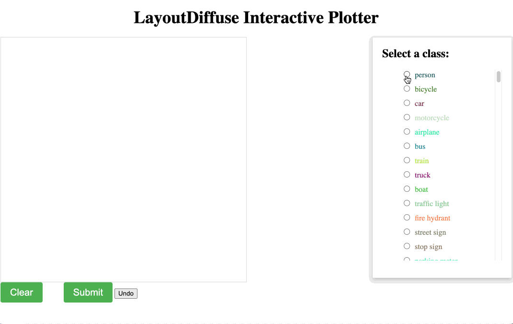

### Code release for [LayoutDiffuse: Adapting Foundational Diffusion Models for Layout-to-Image Generation](https://github.com/cplusx/layout_diffuse)

---

### 0. Installation
#### 0.1 
Follow the official instruction from the [website](https://pytorch.org/get-started/locally/). Install the correct pytorch according to your hardware.
```
git clone https://github.com/cplusx/layout_diffuse.git
pip install -r requirements.txt
```
<details>
  <summary>Optional downloading</summary>
  
    #### 0.2  Download dataset (optional, only required for training)

    Download dataset. Run 
    ```
    bash scripts/download_coco.sh
    bash scripts/download_vg.sh
    bash scripts/download_celebMask.sh
    ```

    This should create a folder in `~/disk2/data` and put all files in that folder.


    *Note for celebMask*: 
    1. You might have see problem when downloading celebMask dataset saying that the file has been downloaded too many times. You will need to go to their [website](https://github.com/switchablenorms/CelebAMask-HQ) to download. 
    2. You need to use this [script](https://github.com/switchablenorms/CelebAMask-HQ/blob/master/face_parsing/Data_preprocessing/g_mask.py) to convert celebMask part-ground-truth to mask-ground-truth.

    #### 0.3 (Optional, only required for training)
    Download foundational pretrained models, run
    ```
    bash scripts/download_pretrained_models.sh {face|ldm|SD1_5|SD2_1|all}
    ```

    #### 0.4 (Optional) log experiments with WandB
    The visualization depends on `wandb`, remember to set it on your server by `wandb login`.
  
</details>


---

### 1. Sampling with trained models

Download model weights for [COCO backboned with SD2.1](https://huggingface.co/cplusx/LD/resolve/main/LD_SD2_1.ckpt) [COCO backboned with SD1.5 coming soon](), (deprecated)~~[COCO](https://automl-mm-bench.s3.amazonaws.com/layoutdiffuse/v1/model_release/coco/epoch=0059.ckpt), [COCO w/o text](https://automl-mm-bench.s3.amazonaws.com/layoutdiffuse/v1/model_release/coco_no_text/epoch=0059.ckpt), [VG](https://automl-mm-bench.s3.amazonaws.com/layoutdiffuse/v1/model_release/vg/latest.ckpt) or [celebMask](https://automl-mm-bench.s3.amazonaws.com/layoutdiffuse/v1/model_release/celeb_mask/latest.ckpt)~~ and put weights under folder `experiments/cocostuff_LayoutDiffuse_SD{2_1|1_5}` or (deprecated)~~`experiments/{cocostuff/cocostuff_no_text/vg/celeb_mask}_LayoutDiffuse`~~

There are three ways to sample from the model:

1. **Recommended**: using interactive webpage. This is the work around before Gradio supports bounding box input. You will need flask to run the server. To obtain better image quality, we use chatGPT to generate text prompts. You need to set up your OpenAI API key if you want to use. **NOTE**: If not providing openai api key, it will use default text prompt by concatenating the class labels (e.g. person, dog, car, etc.), the result may have semantic meaningless background.

```
pip install flask
python sampling_in_background.py -c configs/cocostuff_SD2_1.json --openai_api_key [OPENAI_API_KEY]
# open another terminal
cd interactive_plotting
export FLASK_APP=app.py
flask run
```


2. Use [Gradio](https://gradio.app/) to use LayoutDiffuse. Gradio has not supported bounding box input yet, so we current support to upload a reference image and generating an image with the same layout. The layout is detected by a YOLOv5 model. **NOTE**: If not providing openai api key, it will use default text prompt by concatenating the class labels (e.g. person, dog, car, etc.), the result may have semantic meaningless background
```
pip install gradio
python run_gradio.py -c configs/cocostuff_SD2_1.json --openai_api_key [OPENAI_API_KEY]
```

3. Sampling many images (using COCO dataset). This is for benchmarking purpose.
See [notebooks for single image sample](sampling.ipynb) or running sampling for the dataset
```
python sampling.py -c configs/cocostuff_SD2_1.json # sampling code for cocostuff, replace it with other config files for vg or celeb mask
```

---

### 2. Training
```
python main.py -c configs/cocostuff_SD1_5.json
```
You can change the config files to other dataset in `configs`

---

### 3. Training on custom data
See [code structure](DDIM_ldm/README.md) for details.
---

This code is developed using a variety of resources from [this repository](https://github.com/lucidrains/denoising-diffusion-pytorch)