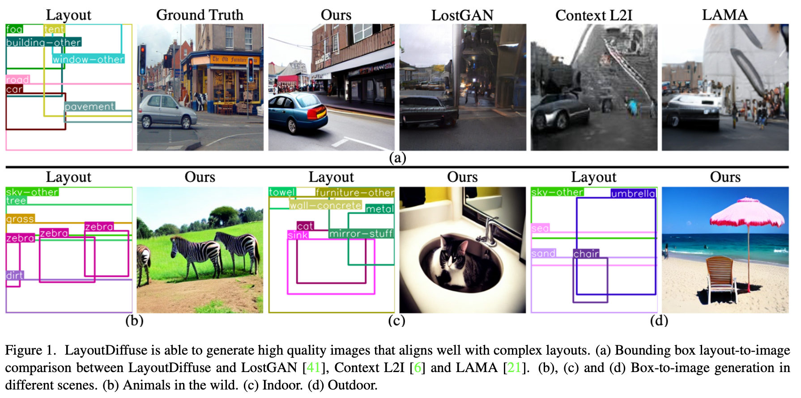

### Code release for [LayoutDiffuse: Adapting Foundational Diffusion Models for Layout-to-Image Generation](https://github.com/cplusx/layout_diffuse)

---

### 0. Installation
#### 0.1 
Follow the official instruction from the [website](https://pytorch.org/get-started/locally/). Install the correct pytorch according to your hardware.
```
git clone [this repositoty]
pip install -r requirements.txt
```

#### 0.2  Download dataset

Download dataset. Run 
```
bash scripts/download_coco.sh
bash scripts/download_vg.sh
bash scripts/download_celebMask.sh
```

This should create a folder in `~/disk2/data` and put all files in that folder.


*Note for celebMask*: 
 1. You might have see problem when downloading celebMask dataset saying that the file has been downloaded too many times. You will need to go to their [website](https://github.com/switchablenorms/CelebAMask-HQ) to download. 
 2. You need to use this [script](https://github.com/switchablenorms/CelebAMask-HQ/blob/master/face_parsing/Data_preprocessing/g_mask.py) to convert celebMask part-ground-truth to mask-ground-truth.

#### 0.3
Download foundational pretrained models, run
```
bash scripts/download_pretrained_models.sh {face|ldm|SD1_5|SD2_1|all}
```

#### 0.4 (Optional) log experiments with WandB
The visualization depends on `wandb`, remember to set it on your server by `wandb login`.

---

### 1. Sampling with trained models

Download model weights for [COCO backboned with SD2.1](https://huggingface.co/cplusx/LD/resolve/main/LD_SD2_1.ckpt) [COCO backboned with SD1.5 coming soon](), (deprecated)~~[COCO](https://automl-mm-bench.s3.amazonaws.com/layoutdiffuse/v1/model_release/coco/epoch=0059.ckpt), [COCO w/o text](https://automl-mm-bench.s3.amazonaws.com/layoutdiffuse/v1/model_release/coco_no_text/epoch=0059.ckpt), [VG](https://automl-mm-bench.s3.amazonaws.com/layoutdiffuse/v1/model_release/vg/latest.ckpt) or [celebMask](https://automl-mm-bench.s3.amazonaws.com/layoutdiffuse/v1/model_release/celeb_mask/latest.ckpt)~~ and put weights under folder `cocostuff_LayoutDiffuse_SD{2_1|1_5}` or (deprecated)~~`experiments/{cocostuff/cocostuff_no_text/vg/celeb_mask}_LayoutDiffuse`~~

There are three ways to sample from the model:

1. Recommended: using interactive webpage. This is the work around before Gradio supports bounding box input. You will need flask to run the server. To obtain better image quality, we use chatGPT to generate text prompts. You need to set up your OpenAI API key if you want to use. If not providing openai api key, it will use default text prompt by concatenating the class labels (e.g. person, dog, car, etc.), the result may have semantic meaningless background.
```
pip install flask
python sampling_in_background.py -c configs/cocostuff_SD2_1.json --opanai_api_key [OPENAI_API_KEY] # if not providing openai api key, it will use default text prompt by concatenating the class labels (e.g. person, dog, car, etc.), the result may have semantic meaningless background.
# open another terminal
cd interactive_plotting
export FLASK_APP=app.py
flask run
```


2. Use [Gradio](https://gradio.app/) to use LayoutDiffuse. Gradio has not supported bounding box input yet, so you will need to specify the COCO image that you want to sample.
```
pip install gradio
python run_gradio.py
```

3. Sampling many images (using COCO dataset). This is for benchmarking purpose.
See [notebooks for single image sample](sampling.ipynb) or running sampling for the dataset
```
python sampling.py -c configs/cocostuff_SD2_1.json # sampling code for cocostuff, replace it with other config files for vg or celeb mask
```

---

### 2. Training
```
python main.py -c configs/cocostuff.json
```
You can change the config files to other dataset in `configs`

---

### 3. Structure of the code (For training on custom data)
If you want to train on your dataset, you may need following knowledge
#### 2.1 [main.py](main.py)
The entrance of the program for training. It does following things:
* Create denoising/vqvae/text models in the config json. The denoising/vqvae/text model is a regular `pytorch module`.
* Create a DDIM training instance which is a `pytorch lightning module`. (e.g., the training class for COCO is `DDIM_LDM_LAION_Text`, you can find the class in json config file)
* Prepare dataset and dataloader.
* Create callbacks for checkpointing and visualization (see [callbacks README](callbacks/README.md) for details).
* Create a `pytorch lightning` `Trainer` instance for training. 

#### 2.2 [Denoising model](modules)
The denoising model is a [UNet model](modules/openai_unet/openaimodel_layout_diffuse.py) that takes layout information and (optional) text prompts.

#### 2.3 [Latent diffusion model](DDIM_ldm)
The folder contains the code for diffusion.
Class [DDIM_LDM](DDIM_ldm/DDIM_ldm.py) contains the coefficients and functions for diffusion and denoising process. 

Class [DDIM_LDMTraining](DDIM_ldm/DDIM_ldm.py) contains the code for
* Training (need to follow pl gramma)
* Validation/testing (need to follow pl gramma)
* Sampling
* Initializing optimizer

Class [DDIM_LDM_VQVAETraining](DDIM_ldm/DDIM_ldm.py) adds on VQVAE encoder and decoder.

Class [DDIM_LDM_Text_VQVAETraining](DDIM_ldm/DDIM_ldm.py) adds on text model

In most of the cases, you only need to overwrite the `DDIM_LDM_VQVAETraining` or `DDIM_LDM_Text_VQVAETraining` class for a customized training.

You can see class `DDIM_LDM_LAION_Text` to understand how to derive these class for each dataset/task.

Functions `trianing_step`, `validation_step` and `test_step` will return a dictionary. This dictonary will be the `outputs` arguments in the callback functions. You can use this dictionary for visualization e.t.c.


#### 2.4 [Callbacks](callbacks)
see callbacks' [readme](callbacks/README.md)

#### 2.5 [Data](data)
The function of this folder is to return a training loader or validation loader. 

In most of the cases you can use the off-the-shelf datasets (e.g. official ones in `torchvison`). The only thing you need to modify is to overwrite the `process_batch()` funcation in `DDIM_LDM_VQVAETraining`.

---

This code is developed using a variety of resources from [this repository](https://github.com/lucidrains/denoising-diffusion-pytorch)